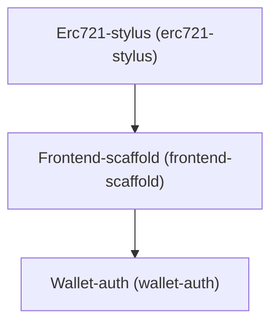

# Architecture

## Dependency Graph

```mermaid
graph TD
  506dc698["Erc721-stylus (erc721-stylus)"]
  b218870e["Frontend-scaffold (frontend-scaffold)"]
  9b156934["Wallet-auth (wallet-auth)"]
  506dc698 --> b218870e
  b218870e --> 9b156934
```

## Execution / Implementation Order

1. **Erc721-stylus** (`506dc698`)
2. **Frontend-scaffold** (`b218870e`)
3. **Wallet-auth** (`9b156934`)
